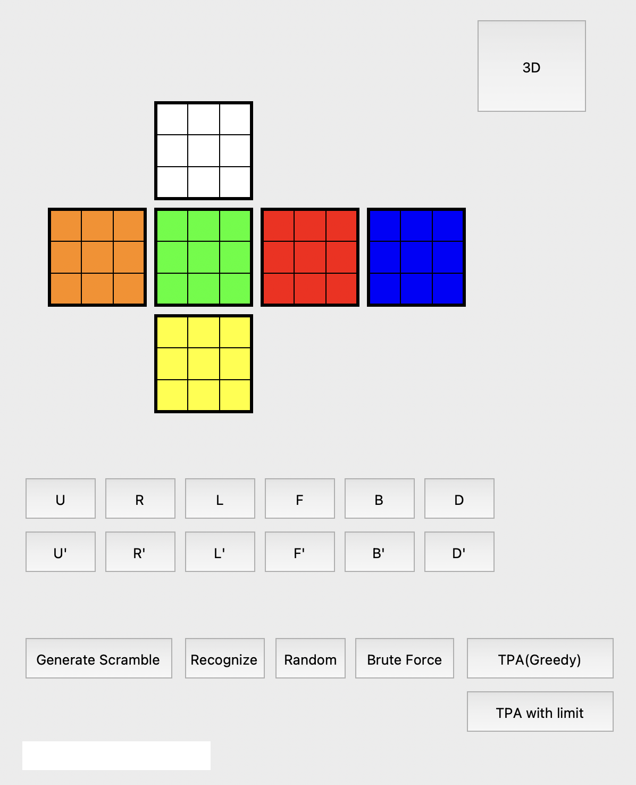
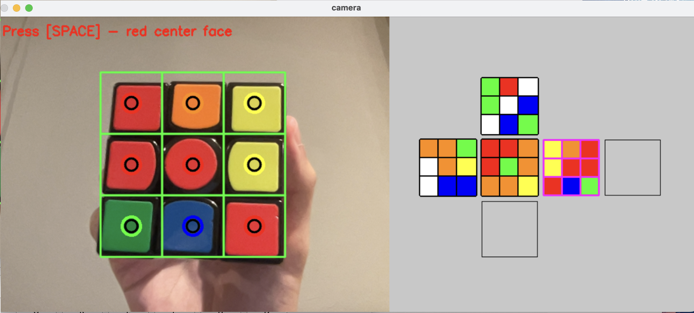

# Rubiks-Cube-Solver
Pythonで3×3ルービックキューブをGUIで操作、表示することができるプログラムです。カメラ画像からキューブの状態を認識し、Two-Phase Algorithmで解法を求めることができます。

# 動作環境
- Numpy
- Matplotlib
- OpenCV
- timeout-decorator

# 使用方法
```bash
__init__.pyを実行することでプログラムを起動できます。
Recognizeボタンでキューブを認識できます。スペースボタンで一面ずつ認識します。
展開図通りの向きで認識しなければならないことに注意が必要です。
Matplotlibによる3D表示も可能です。

pycharm環境で開発していましたが、IDLEやVScode環境を試すとエラー（クラッシュ）が多発しました。
クラッシュが続く場合はpycharmを使用してみてください。
```



# 参考にしたサイト
- [Pythonで3×3ルービックキューブを解くプログラムの作成（Qiita / 7y2n）](https://qiita.com/7y2n/items/a840e44dba77b1859352)

Two-Phase Algorithm の実装や考え方について参考にさせていただきました。