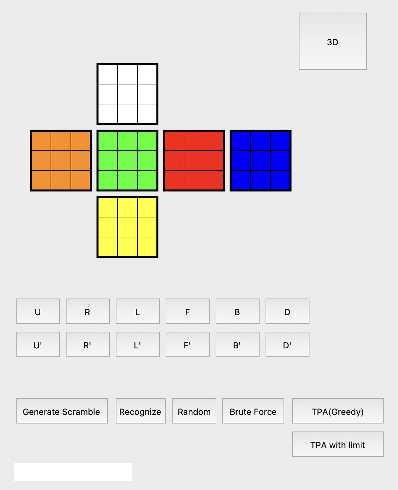
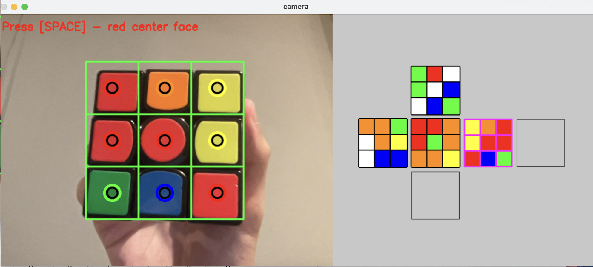

# Rubiks-Cube-Solver
Pythonで3×3ルービックキューブをGUIで操作、表示することができるプログラムです。カメラ画像からキューブの状態を認識し、Two-Phase Algorithmで解法を求めることができます。

# 動作環境
- Numpy
- Matplotlib
- OpenCV
- timeout-decorator

# 使用方法
```bash
__init__.pyを実行することでプログラムを起動できます。
Recognizeボタンでキューブを認識できます。スペースボタンで一面ずつ認識します。
展開図通りの向きで認識しなければならないことに注意が必要です。
Matplotlibによる3D表示も可能です。
Two-Phase Algorithm, Brute Forceなど複数の方法で解を探索することが可能です。
```

# 解法一覧
- **Random**
: ランダムに回転することで解を求める
- **Brute Force**
: 総当たりで解を求める
- **TPA(Greedy)**
: Two-Phase Algorithmで最も早く発見された解を表示する
- **TPA with limit**
: 制限時間を自分で設定し、その時間で見つかった中での最短手を表示する

# 実行画面



# 参考にしたサイト
- [Pythonで3×3ルービックキューブを解くプログラムの作成（Qiita / 7y2n）](https://qiita.com/7y2n/items/a840e44dba77b1859352)

Two-Phase Algorithm の実装や考え方について参考にさせていただきました。